# 📈 Stock Trading Platform | MERN Full Stack Project

A full-stack **MERN-based Stock Trading Platform** built with **MongoDB, Express, React, and Node.js**, inspired by leading brokers.  
It allows users to **sign up, log in with JWT authentication**, and access a simulated stock trading dashboard with holdings, positions, orders, and watchlist management.


---

## 🚀 Features

### 🧭 Frontend
- Built using **React (Create React App)** for both **landing page and dashboard**.
- **Public landing page** visible without login.
- **Dashboard** access restricted to authenticated users.
- **JWT-based Authentication** integrated with cookies.
- **React Toastify** for success/error notifications.
- **Charts** created using `react-chartjs-2` for:
  - **Bar chart:** user’s stock holdings.
  - **Doughnut chart:** watchlist stocks based on prices.
- **Material UI**, **Bootstrap**, and **custom CSS** used for UI styling.
- **Routing** handled via `react-router-dom`.
- **Logout** functionality implemented with cookie clearing and redirection.

### ⚙️ Backend
- Built using **Node.js** and **Express.js**.
- **MongoDB + Mongoose** for data persistence.
- **JWT (jsonwebtoken)** for authentication and authorization.
- **bcrypt** for password hashing.
- **CORS** and **cookie-parser** configured for secure frontend–backend communication.
- **dotenv** used for environment variable management.
- Includes routes for:
  - **User Authentication** (`/signup`, `/login`, `/logout`)
  - **Orders, Holdings, Positions** fetching and creation.
- Modular structure with `models`, `controllers`, and `routes`.

---

## 🧱 Tech Stack

| Layer | Technology |
|-------|-------------|
| **Frontend** | React, Material UI, Bootstrap, Chart.js, React Toastify |
| **Backend** | Node.js, Express.js |
| **Database** | MongoDB, Mongoose |
| **Authentication** | JWT (JSON Web Token) |
| **Testing** | Jest (for frontend component testing) |
| **Deployment** | Render (for both frontend & backend) |

---

## 🧩 Project Structure
```bash
📦 stock-trading-platform
├── 📁 backend
│ ├── controllers/
│ ├──middlewares/
│ ├── model/
│ ├──routes/
│ ├──schema/
│ ├──util/
│ ├── index.js
│ ├── package-lock.json
│ └── package.json
│
├── 📁 dashboard (React App)
│ ├── public/
│ ├── src/
│ │ ├── components/
│ │ ├── data/
│ │ ├── index.css
│ │ └── index.js
│ ├── package-lock.json
│ └── package.json
│
├── 📁 frontend (Landing page React App)
│ ├── public/
│ ├── src/
│ │ ├── landing_page/
│ │ ├── test/
│ │ ├── index.css
│ │ └── index.js
│ ├── package-lock.json
│ └── package.json
├── 📁screenshots/
├── .gitignore
└── README.md

```
---

## 🔐 Authentication Flow

1. User **signs up or logs in**.
2. Server generates a **JWT token** and stores it in cookies (`httpOnly`).
3. Protected routes (dashboard) verify token validity via middleware.
4. Unauthorized users are redirected to the **login page**.
5. **Logout** clears the JWT cookie.

---

## 🧠 Highlights

- Simple yet scalable **MERN architecture**.
- **Fully working authentication** using JWT cookies.
- **Toast notifications** for interactive UX.
- Basic **chart visualization** using Chart.js.
- **Component-based UI design** using React.
- **Render deployment** for live access.

---

## 🧪 Testing

- **Frontend testing** implemented using **Jest**.
- Example test file:
 
Tests rendering and functionality of the Hero component.

---

## ⚠️ Limitations / Future Scope

- Currently, the same dashboard is displayed for all users.
- Live stock API not used (requires paid API access).
- Future improvements:
- Personalized dashboard per user.
- Integration with real-time stock data APIs.
- Enhanced portfolio analytics.

---


## 🏗️ Setup and Run Locally

### 1️⃣ Clone the repository
```bash

git clone <your-repo-url>
cd stock-trading-platform
cd backend
npm install

cd ../dashboard
npm install

cd ../frontend
npm install
```
## 2️⃣ Setup environment variables
```bash
Create a `.env` file in  `backend/` and `dashboard/` `frontend/` directories.

### Backend `.env`

PORT=3002
MONGO_URL=your_mongodb_connection_string
TOKEN_KEY=your_secret_key
FRONTEND_URL=http://localhost:3000 (replace this link with your  frontend's render url)
DASHBOARD_URL=http://localhost:3001 (replace this link with your  dashboard's render url)

### Frontend `.env`

REACT_APP_BACKEND_URL=http://localhost:3002 (replace this link with your  backend's render url)
REACT_APP_DASHBOARD_URL=http://localhost:3001 (replace this link with your  dashboard's render url)

### Dashboard `.env`

REACT_APP_BACKEND_URL=http://localhost:3002 (replace this link with your  backend's render url)
REACT_APP_FRONTEND_URL=http://localhost:3000 (replace this link with your  frontend's render url)
```
## 3️⃣ Start each service:

```bash
### Backend
cd backend
npm start 

### Frontend

open a new terminal then run frontend and run it before dashboard

cd frontend 
npm start
### Dashboard
open a new terminal then run dashboard and run it after frontend

cd frontend 
npm start

```
---

## By default:

Frontend runs on http://localhost:3000

Dashboard runs on http://localhost:3001

Backend API runs on http://localhost:3002

---

> 🌐 **Live Demo:** [https://stock-trading-platform-0svb.onrender.com](https://stock-trading-platform-0svb.onrender.com)

---

## 🖼️ Screenshots

### 🏠 Landing Page
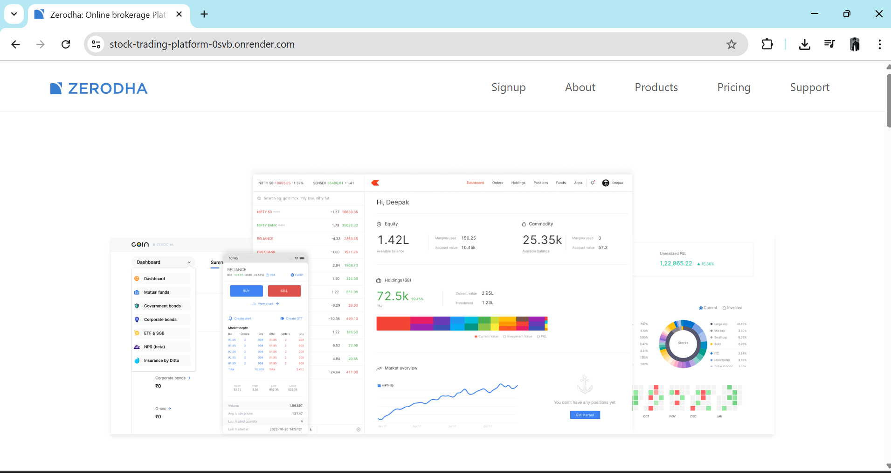
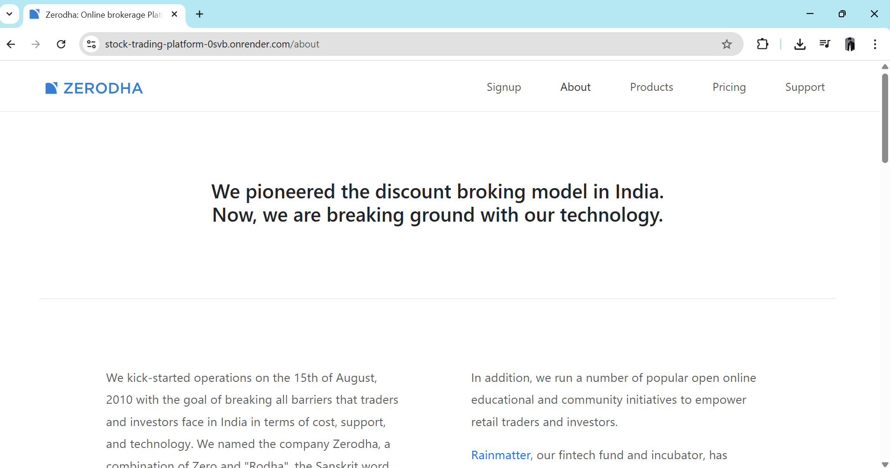
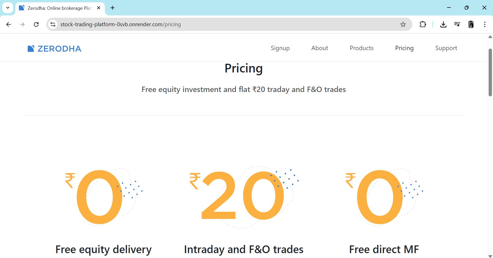
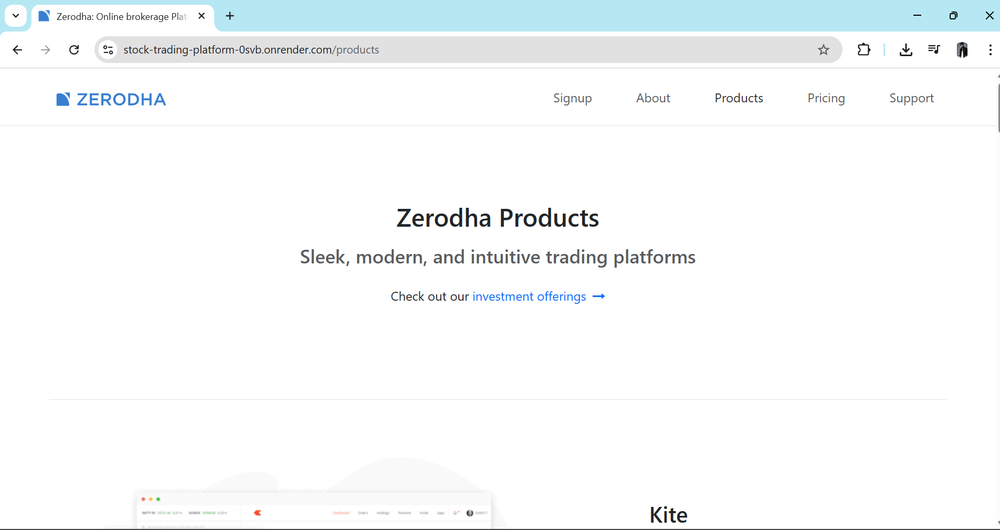
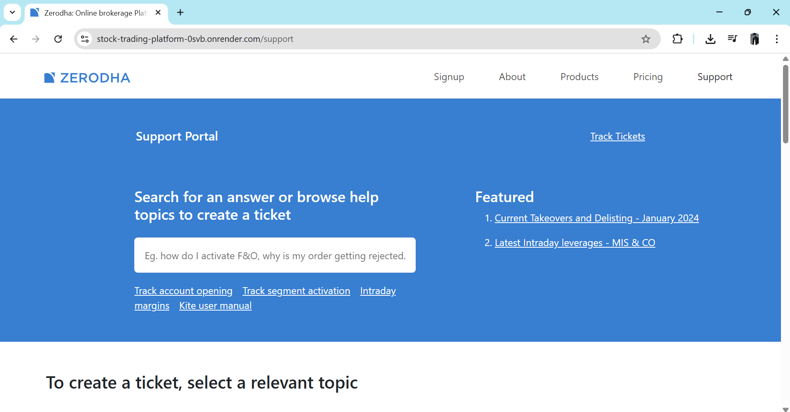

### 🔐 Signup Page
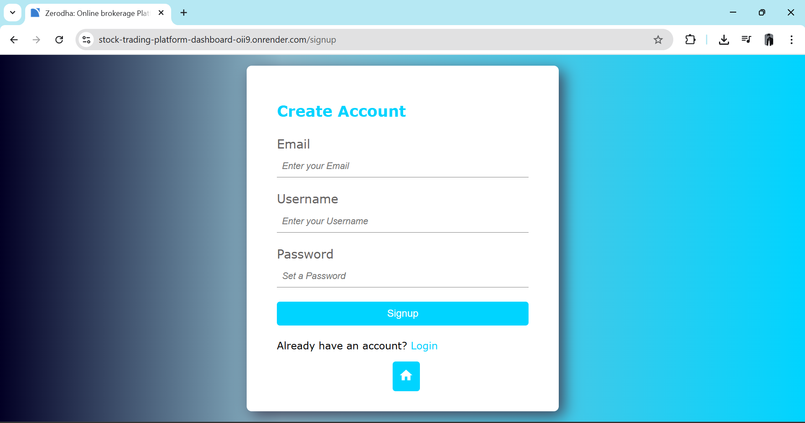

### 🔐 Login Page
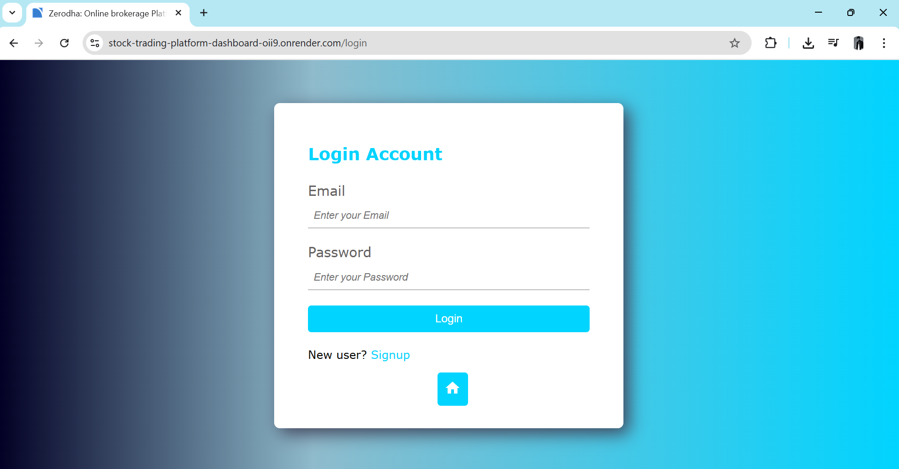

### 📊 Dashboard Overview
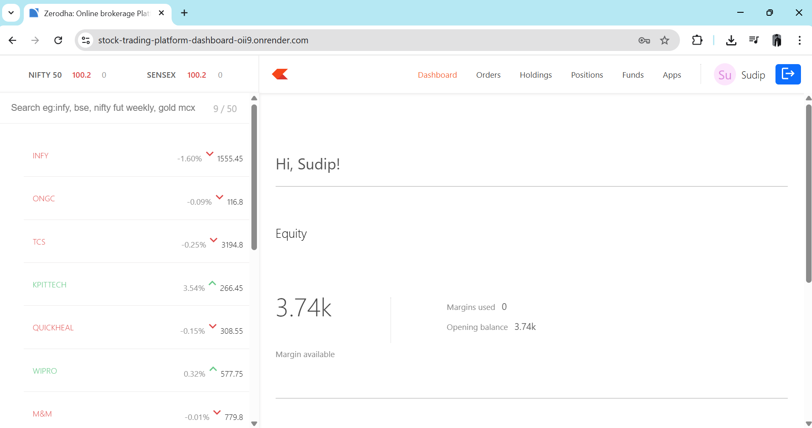
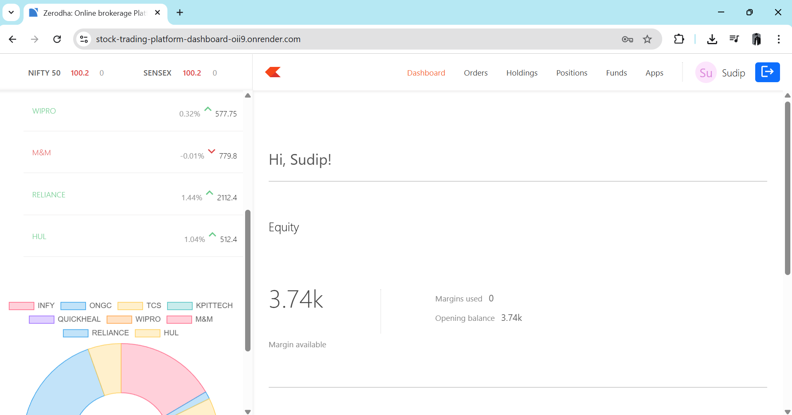
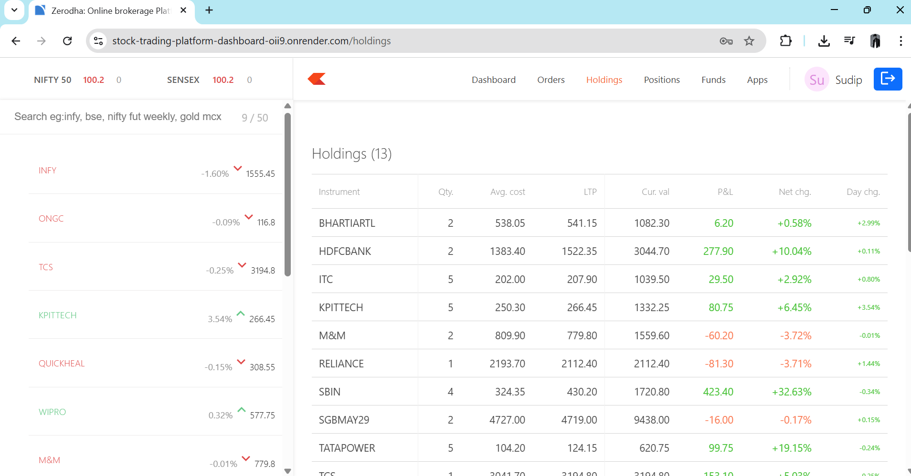
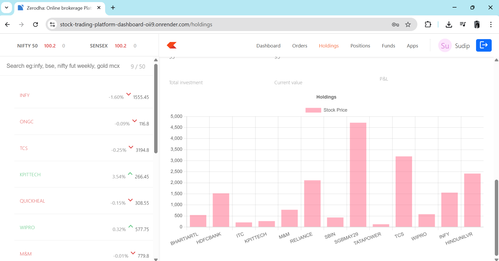
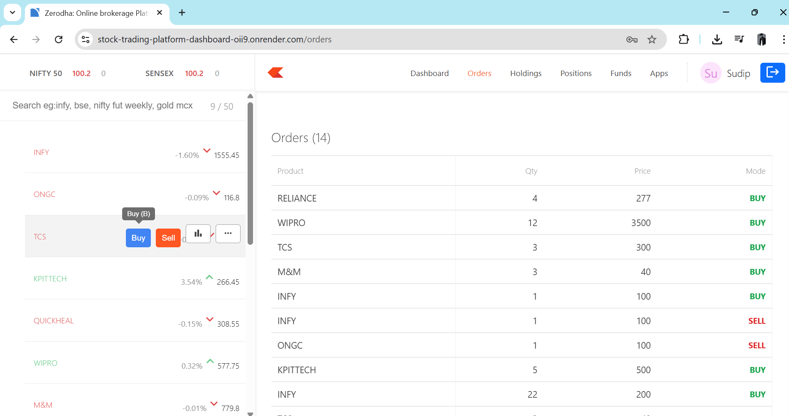


 